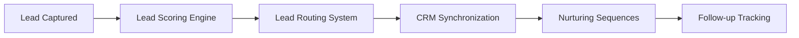

# Lead & CRM Agent - Workflow API Endpoints

## Overview
This document describes the API endpoints and webhook URLs for all n8n workflows in the Lead & CRM system.

## Base Configuration

### Environment Variables Required
```bash
# API Base URLs
API_BASE_URL=http://localhost:3000
WEBHOOK_BASE_URL=http://localhost:3000
NOTIFICATION_BASE_URL=http://localhost:3000
ANALYTICS_BASE_URL=http://localhost:3000
SMS_BASE_URL=http://localhost:3000
FOLLOWUP_BASE_URL=http://localhost:3000

# CRM System Configuration
DEFAULT_CRM=hubspot
HUBSPOT_API_KEY=your_hubspot_api_key
SALESFORCE_API_URL=your_salesforce_instance_url
SALESFORCE_ACCESS_TOKEN=your_salesforce_token

# n8n Webhook URLs
N8N_BASE_URL=http://localhost:5678
N8N_WEBHOOK_BASE_URL=http://localhost:5678/webhook
```

## Workflow Endpoints

### 1. Lead Scoring Engine

#### Webhook Endpoint
```http
POST http://localhost:5678/webhook/new-lead-scoring
Content-Type: application/json
```

#### Request Payload
```typescript
interface LeadScoringRequest {
  leadId: string;
  email: string;
  firstName: string;
  lastName?: string;
  phone?: string;
  projectType: 'roof-repair' | 'roof-replacement' | 'new-construction' | 'inspection' | 'emergency' | 'storm-damage';
  urgency: 'immediate' | 'within-month' | 'within-quarter' | 'planning-ahead';
  source: {
    channel: string;
    campaign?: string;
    referrer?: string;
    utm_source?: string;
    utm_medium?: string;
    utm_campaign?: string;
  };
  
  // Behavioral scoring data
  websiteEngagement?: {
    pagesVisited?: number;
    timeOnSiteMinutes?: number;
    returnVisits?: number;
    bounceRate?: number;
  };
  
  contentConsumption?: {
    downloads?: number;
    videoViews?: number;
    guideReads?: number;
    calculatorUsage?: number;
  };
  
  formInteractions?: {
    completionRate?: number;
    fieldFocusTimeSeconds?: number;
    progressiveSteps?: number;
  };
  
  // Demographic scoring data
  location?: {
    inServiceArea?: boolean;
    distanceMiles?: number;
    neighborhoodValuePercentile?: number;
    zipCode?: string;
    city?: string;
    state?: string;
  };
  
  propertyType?: 'residential' | 'commercial' | 'multi-family';
  budgetIndicators?: {
    budgetRange?: 'under-10k' | '10k-25k' | '25k-50k' | '50k-plus' | 'need-estimate';
    estimatedValue?: number;
  };
  
  // Interaction scoring data
  responseSpeed?: number; // minutes
  communicationQuality?: number; // 0-10 scale
  preferredContact?: 'phone' | 'email' | 'text';
  timeline?: 'immediate' | 'within-week' | 'within-month' | 'within-quarter' | 'planning-ahead';
  decisionMaker?: boolean;
  previousContractorExperience?: 'positive' | 'negative' | 'mixed' | 'none' | 'unknown';
}
```

#### Response
```typescript
interface LeadScoringResponse {
  leadId: string;
  leadScore: number; // 0-100
  priorityLevel: 'hot' | 'warm' | 'cold' | 'unqualified';
  priorityDescription: string;
  recommendedActions: string[];
  scoringBreakdown: {
    behavioral: { score: number; details: string[] };
    demographic: { score: number; details: string[] };
    sourceQuality: { score: number; details: string[] };
    interaction: { score: number; details: string[] };
  };
  scoredAt: string;
}
```

### 2. Lead Routing System

#### Webhook Endpoint
```http
POST http://localhost:5678/webhook/lead-scored
Content-Type: application/json
```

#### Request Payload
```typescript
interface LeadRoutingRequest {
  leadId: string;
  leadScore: number;
  priorityLevel: 'hot' | 'warm' | 'cold' | 'unqualified';
  firstName: string;
  lastName?: string;
  email: string;
  phone?: string;
  projectType: string;
  urgency: string;
  source: object;
  recommendedActions: string[];
  
  location?: {
    zipCode?: string;
    city?: string;
    state?: string;
    coordinates?: { lat: number; lng: number };
  };
  
  projectDetails?: {
    propertyType?: string;
    estimatedValue?: number;
    complexity?: 'simple' | 'standard' | 'complex';
    timeline?: string;
  };
}
```

#### Response
```typescript
interface LeadRoutingResponse {
  leadId: string;
  routing: {
    selectedMember: {
      memberId: string;
      memberName: string;
      memberEmail: string;
      memberPhone: string;
      role: string;
      matchScore: number;
      reasonForMatch: string[];
    };
    alternativeMembers: object[];
    routingReason: string;
    maxResponseTime: number;
    routingType: string;
    escalated?: boolean;
    immediateContact: boolean;
    notificationChannels: string[];
  };
  assignedAt: string;
}
```

### 3. CRM Synchronization

#### Webhook Endpoint
```http
POST http://localhost:5678/webhook/crm-sync
Content-Type: application/json
```

#### Request Payload
```typescript
interface CRMSyncRequest {
  leadId: string;
  email: string;
  firstName: string;
  lastName?: string;
  phone?: string;
  address?: {
    street?: string;
    street2?: string;
    city?: string;
    state?: string;
    zipCode?: string;
    country?: string;
  };
  
  projectType: string;
  propertyType?: string;
  urgency?: string;
  budgetRange?: string;
  estimatedValue?: number;
  
  leadScore: number;
  priorityLevel: string;
  scoringBreakdown?: object;
  
  source?: {
    channel?: string;
    campaign?: string;
    referrer?: string;
    utm_source?: string;
    utm_medium?: string;
    utm_campaign?: string;
  };
  
  assignedTo?: string;
  assignedToName?: string;
  assignedAt?: string;
  
  status?: string;
  lifecycle?: string;
  createdAt?: string;
  
  roofingSpecific?: {
    currentRoofAge?: number;
    roofMaterial?: string;
    roofSize?: string;
    issues?: string[];
    stormDamage?: boolean;
    insuranceClaim?: boolean;
    previousWork?: string;
    timeframe?: string;
  };
  
  crmSystem?: 'hubspot' | 'salesforce';
  syncTrigger?: string;
}
```

#### Response
```typescript
interface CRMSyncResponse {
  leadId: string;
  crmSystem: 'hubspot' | 'salesforce';
  syncStatus: 'success' | 'error';
  syncTimestamp: string;
  crmContactId: string;
  crmDealId?: string;
  dealAmount?: number;
  dealStage?: string;
  dealProbability?: number;
  syncDetails: {
    contactCreated: boolean;
    dealCreated: boolean;
    crmVersion: string;
    syncMethod: string;
  };
}
```

## Application API Endpoints

### Lead Management APIs

#### Create/Update Lead Score
```http
PUT /api/leads/{leadId}/score
Content-Type: application/json

{
  "leadScore": 85,
  "priorityLevel": "hot",
  "priorityDescription": "High-priority lead requiring immediate contact",
  "recommendedActions": ["Call within 15 minutes", "Send SMS notification"],
  "scoringBreakdown": { ... },
  "scoredAt": "2025-09-07T22:00:00Z"
}
```

#### Assign Lead to Team Member
```http
POST /api/leads/assign
Content-Type: application/json

{
  "leadId": "lead_123",
  "assignedTo": "team_member_456",
  "assignedToName": "John Smith",
  "assignedToEmail": "john@alpinepeakroofing.com",
  "assignedToPhone": "+1234567890",
  "priorityLevel": "hot",
  "leadScore": 85,
  "routingReason": "Best skill and workload match",
  "maxResponseTime": 15,
  "routingType": "hot_lead_priority",
  "escalated": false,
  "assignedAt": "2025-09-07T22:00:00Z",
  "routing": { ... }
}
```

#### Update CRM Sync Status
```http
PUT /api/leads/{leadId}/crm-sync
Content-Type: application/json

{
  "leadId": "lead_123",
  "crmSystem": "hubspot",
  "syncStatus": "success",
  "syncTimestamp": "2025-09-07T22:00:00Z",
  "crmContactId": "hubspot_contact_789",
  "crmDealId": "hubspot_deal_101",
  "dealAmount": 25000,
  "dealStage": "appointmentscheduled",
  "dealProbability": 0.8,
  "lastSyncError": null,
  "syncDetails": { ... }
}
```

### Team Management APIs

#### Get Team Availability
```http
GET /api/team/availability
```

Response:
```typescript
interface TeamAvailabilityResponse {
  availableMembers: Array<{
    id: string;
    name: string;
    email: string;
    phone: string;
    role: string;
    currentLeadCount: number;
    serviceAreas: string[];
    specialties: string[];
    recentPerformanceScore: number;
    availability: 'available' | 'busy' | 'offline';
  }>;
  totalTeamMembers: number;
  averageWorkload: number;
  timestamp: string;
}
```

### Notification APIs

#### Send Lead Assignment Notification
```http
POST /api/notifications/lead-assignment
Content-Type: application/json

{
  "leadId": "lead_123",
  "assignedTo": {
    "id": "team_member_456",
    "name": "John Smith",
    "email": "john@alpinepeakroofing.com",
    "phone": "+1234567890"
  },
  "leadData": {
    "name": "Jane Doe",
    "email": "jane@example.com",
    "phone": "+0987654321",
    "projectType": "roof-replacement",
    "urgency": "immediate",
    "score": 85,
    "priority": "hot"
  },
  "assignment": {
    "routingReason": "Best skill and workload match",
    "maxResponseTime": 15,
    "routingType": "hot_lead_priority",
    "escalated": false,
    "immediateContact": true
  },
  "notificationChannels": ["email", "sms"],
  "timestamp": "2025-09-07T22:00:00Z"
}
```

#### Send Hot Lead Alert
```http
POST /api/notifications/hot-lead-alert
Content-Type: application/json

{
  "leadId": "lead_123",
  "leadName": "Jane Doe",
  "leadScore": 85,
  "projectType": "roof-replacement",
  "phone": "+0987654321",
  "email": "jane@example.com",
  "urgency": "HOT LEAD - Immediate Action Required",
  "notificationChannels": ["email", "sms", "slack"]
}
```

### SMS & Communication APIs

#### Send Urgent SMS Alert
```http
POST /api/sms/urgent-assignment
Content-Type: application/json

{
  "to": "+1234567890",
  "message": "URGENT: Hot lead Jane Doe assigned to you. Score: 85. roof-replacement project. Contact within 15 minutes. Lead ID: lead_123",
  "leadId": "lead_123",
  "priority": "urgent"
}
```

### Follow-up & Scheduling APIs

#### Schedule Follow-up Reminder
```http
POST /api/followup/schedule
Content-Type: application/json

{
  "leadId": "lead_123",
  "assignedTo": "team_member_456",
  "followUpType": "initial_contact",
  "scheduleFor": "2025-09-07T22:15:00Z",
  "priorityLevel": "hot",
  "contactMethod": "phone",
  "notes": "Initial contact follow-up for hot lead",
  "automated": true
}
```

### Analytics & Reporting APIs

#### Log Lead Scoring Analytics
```http
POST /api/analytics/lead-scoring
Content-Type: application/json

{
  "event": "lead_scored",
  "leadId": "lead_123",
  "score": 85,
  "priority": "hot",
  "source": "contact-form",
  "timestamp": "2025-09-07T22:00:00Z",
  "scoringBreakdown": { ... }
}
```

#### Log Lead Routing Analytics
```http
POST /api/analytics/lead-routing
Content-Type: application/json

{
  "event": "lead_routed",
  "leadId": "lead_123",
  "assignedTo": "team_member_456",
  "assignedToName": "John Smith",
  "routingScore": 95,
  "priorityLevel": "hot",
  "leadScore": 85,
  "routingType": "hot_lead_priority",
  "routingReason": "Best skill and workload match",
  "escalated": false,
  "responseTimeTarget": 15,
  "totalCandidates": 5,
  "timestamp": "2025-09-07T22:00:00Z",
  "routing": { ... }
}
```

#### Log CRM Sync Analytics
```http
POST /api/analytics/crm-sync
Content-Type: application/json

{
  "event": "crm_sync_completed",
  "leadId": "lead_123",
  "crmSystem": "hubspot",
  "leadScore": 85,
  "priorityLevel": "hot",
  "dealAmount": 25000,
  "dealCreated": true,
  "syncDuration": 2.5,
  "timestamp": "2025-09-07T22:00:00Z"
}
```

## Webhook Event Flows

### Lead Capture to Customer Flow


### Workflow Triggers
1. **Lead Scoring**: Triggered by new lead capture
2. **Lead Routing**: Triggered by completed lead scoring
3. **CRM Sync**: Triggered by lead assignment
4. **Nurturing**: Triggered by CRM sync completion

### Error Handling
- All workflows include retry logic for failed API calls
- Error notifications sent to admin team
- Fallback mechanisms for critical path failures
- Complete audit logging for troubleshooting

## Testing & Validation

### Webhook Testing
```bash
# Test lead scoring webhook
curl -X POST http://localhost:5678/webhook/new-lead-scoring \
  -H "Content-Type: application/json" \
  -d @test-lead-data.json

# Test lead routing webhook  
curl -X POST http://localhost:5678/webhook/lead-scored \
  -H "Content-Type: application/json" \
  -d @scored-lead-data.json

# Test CRM sync webhook
curl -X POST http://localhost:5678/webhook/crm-sync \
  -H "Content-Type: application/json" \
  -d @lead-for-sync.json
```

### Integration Testing
1. End-to-end lead processing flow
2. CRM system connectivity validation
3. Team member assignment accuracy
4. Notification delivery confirmation
5. Analytics data integrity

This API documentation provides comprehensive integration points for the Lead & CRM Agent's n8n workflow system with the Alpine Peak Roofing application.