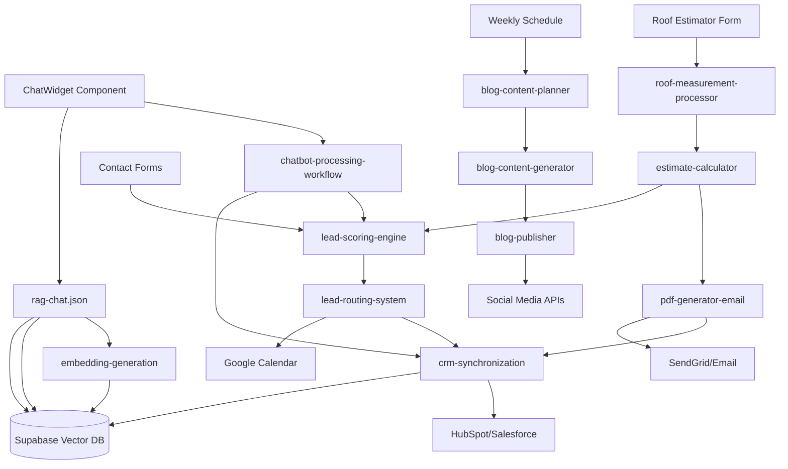

# Alpine Peak Roofing - n8n Workflow Orchestration Guide

## Overview

This document provides a comprehensive guide to the n8n workflow orchestration system for Alpine Peak Roofing's automated business processes. The system consists of **13 interconnected workflows** across 4 main business areas, designed to automate everything from customer interactions to content generation.

---

## 📁 **Centralized Workflow Structure**

All workflows are now organized in the centralized `n8n/workflows/` directory:

```
n8n/
├── workflows/
│   ├── ai-chatbot/                 # AI-powered customer interaction
│   │   ├── chatbot-processing-workflow.json
│   │   ├── embedding-generation.json
│   │   └── rag-chat.json
│   ├── blog-automation/            # Content marketing automation  
│   │   ├── blog-content-planner.json
│   │   ├── blog-content-generator.json
│   │   ├── blog-generation-workflow.json
│   │   └── blog-publisher.json
│   ├── roof-estimator/             # Automated estimation system
│   │   ├── roof-measurement-processor.json
│   │   ├── estimate-calculator.json
│   │   └── pdf-generator-email.json
│   └── lead-crm/                   # Lead management and CRM
│       ├── lead-scoring-engine.json
│       ├── lead-routing-system.json
│       └── crm-synchronization.json
├── templates/
│   └── n8n-workflow-templates.json
└── config/
    └── webhook-endpoints.json (to be created)
```

---

## 🤖 **The Orchestrator Agent Concept**

### What is the Orchestrator Agent?

The **Orchestrator Agent** is a master n8n workflow that coordinates and manages the execution of other workflows. Think of it as the "conductor" of an orchestra - it doesn't play the music itself, but ensures all the musicians (workflows) play in harmony at the right time.

### How Orchestration Works:

1. **Event-Driven Triggers**: The orchestrator listens for specific events (user interactions, scheduled tasks, data changes)
2. **Workflow Selection**: Based on the event type and context, it determines which workflow(s) to execute
3. **Data Flow Management**: It passes data between workflows and manages state across the entire system
4. **Error Handling**: It provides centralized error handling and recovery mechanisms
5. **Performance Monitoring**: It tracks execution times and success rates across all workflows

---

## 🔄 **Current Workflow Inventory & Connections**

### **1. AI Chatbot System (3 workflows)**

#### **a) `chatbot-processing-workflow.json`**
- **Purpose**: Processes basic chat messages and intent classification
- **Triggers**: POST webhook from ChatWidget component
- **Connects To**: Lead scoring engine, CRM synchronization
- **Key Features**: Intent detection, conversation management

#### **b) `embedding-generation.json` ✨ NEW**
- **Purpose**: Generates OpenAI embeddings for knowledge base content
- **Triggers**: Manual trigger or scheduled (after content updates)
- **Connects To**: Supabase knowledge_content table
- **Key Features**: Batch processing, text-embedding-ada-002 integration

#### **c) `rag-chat.json` ✨ NEW** 
- **Purpose**: Advanced RAG-powered chat responses using semantic search
- **Triggers**: POST webhook from ChatWidget for complex queries
- **Connects To**: Supabase vector database, OpenAI GPT-4
- **Key Features**: Semantic search, context-aware responses, 35K+ word knowledge base

### **2. Blog Automation System (4 workflows)**

#### **a) `blog-content-planner.json`**
- **Purpose**: Plans content calendar and topics
- **Triggers**: Weekly scheduled execution
- **Connects To**: Content generator, Google Calendar API
- **Key Features**: SEO keyword research, competitor analysis

#### **b) `blog-content-generator.json`**
- **Purpose**: Generates blog posts using GPT-4
- **Triggers**: Called by content planner or manual trigger
- **Connects To**: WordPress/CMS API, social media publishers
- **Key Features**: AI-generated content, SEO optimization, image integration

#### **c) `blog-generation-workflow.json`** 
- **Purpose**: Legacy workflow for blog generation (to be merged)
- **Status**: Consider consolidating with blog-content-generator.json

#### **d) `blog-publisher.json`**
- **Purpose**: Publishes content across multiple channels
- **Triggers**: Called after content generation
- **Connects To**: WordPress, social media APIs, email marketing
- **Key Features**: Multi-channel publishing, scheduling, analytics tracking

### **3. Roof Estimator System (3 workflows)**

#### **a) `roof-measurement-processor.json`**
- **Purpose**: Processes satellite imagery for roof measurements
- **Triggers**: User submits address through roof estimator form
- **Connects To**: Google Earth Engine API, estimate calculator
- **Key Features**: AI-powered image analysis, area calculations

#### **b) `estimate-calculator.json`**
- **Purpose**: Calculates roofing costs based on measurements and materials
- **Triggers**: Called by measurement processor
- **Connects To**: PDF generator, lead scoring engine
- **Key Features**: Dynamic pricing, material selection, weather adjustments

#### **c) `pdf-generator-email.json`**
- **Purpose**: Generates PDF estimates and emails them to customers
- **Triggers**: Called by estimate calculator
- **Connects To**: SendGrid/email service, CRM system
- **Key Features**: Professional PDF generation, branded templates, follow-up sequences

### **4. Lead & CRM System (3 workflows)**

#### **a) `lead-scoring-engine.json`**
- **Purpose**: Scores and qualifies leads based on behavior and data
- **Triggers**: Called by chatbot, form submissions, estimate requests
- **Connects To**: Lead routing system, CRM synchronization
- **Key Features**: 100-point scoring algorithm, qualification rules

#### **b) `lead-routing-system.json`**
- **Purpose**: Routes qualified leads to appropriate team members
- **Triggers**: Called by lead scoring engine
- **Connects To**: CRM system, notification systems, calendar booking
- **Key Features**: Team assignment, priority routing, automated scheduling

#### **c) `crm-synchronization.json`**
- **Purpose**: Syncs all lead and customer data with CRM platforms
- **Triggers**: Called by various workflows when data changes
- **Connects To**: HubSpot/Salesforce APIs, Supabase database
- **Key Features**: Bi-directional sync, data validation, conflict resolution

---

## 🔗 **Workflow Interconnections Map**



---

## 🎯 **Orchestrator Agent Implementation Plan**

To create a master orchestrator workflow, we would implement:

### **Master Orchestrator Workflow: `alpine-peak-orchestrator.json`**

#### **Core Functions:**
1. **Event Router**: Receives all external triggers and routes to appropriate workflows
2. **State Manager**: Maintains global state across workflow executions  
3. **Data Pipeline**: Manages data flow between workflows
4. **Error Handler**: Centralizes error handling and retry logic
5. **Performance Monitor**: Tracks execution metrics and alerts

#### **Trigger Points:**
- Website form submissions → Route to appropriate workflow
- Scheduled events → Trigger content generation, maintenance tasks
- API webhooks → Process external data updates
- Database changes → Trigger sync and notification workflows
- User interactions → Route to chatbot or estimation systems

#### **Benefits of Orchestration:**
- **Single Point of Control**: All workflows managed from one place
- **Improved Reliability**: Centralized error handling and monitoring
- **Better Performance**: Optimized execution order and resource usage
- **Easier Maintenance**: Changes propagate through the entire system
- **Enhanced Analytics**: Complete view of business process performance

---

## 📊 **Workflow Execution Priorities**

### **Real-Time (Immediate Response Required)**
1. `rag-chat.json` - Customer chat responses
2. `chatbot-processing-workflow.json` - Basic chat processing
3. `lead-scoring-engine.json` - Lead qualification
4. `lead-routing-system.json` - Team notifications

### **Near Real-Time (Within 5 minutes)**
1. `crm-synchronization.json` - Data sync
2. `pdf-generator-email.json` - Estimate delivery

### **Batch Processing (Hourly/Daily)**
1. `roof-measurement-processor.json` - Satellite image analysis
2. `estimate-calculator.json` - Complex calculations
3. `embedding-generation.json` - Knowledge base updates

### **Scheduled Operations**
1. `blog-content-planner.json` - Weekly content planning
2. `blog-content-generator.json` - Content creation
3. `blog-publisher.json` - Content distribution

---

## 🔧 **Webhook Endpoint Configuration**

### **Primary Endpoints:**
```javascript
// ChatWidget integrations
NEXT_PUBLIC_N8N_WEBHOOK_BASE_URL + '/alpine-peak-rag-chat'
NEXT_PUBLIC_N8N_WEBHOOK_BASE_URL + '/chatbot-process'

// Form submissions
NEXT_PUBLIC_N8N_WEBHOOK_BASE_URL + '/lead-capture'
NEXT_PUBLIC_N8N_WEBHOOK_BASE_URL + '/roof-estimate-request'

// Internal workflow triggers
NEXT_PUBLIC_N8N_WEBHOOK_BASE_URL + '/generate-embeddings'
NEXT_PUBLIC_N8N_WEBHOOK_BASE_URL + '/blog-generation'
```

### **Authentication & Security:**
- API key authentication on all webhooks
- Rate limiting to prevent abuse
- IP filtering for internal workflows
- Secure data validation and sanitization

---

## 🚀 **Deployment Strategy**

### **Phase 1: Core Workflows (Week 1)**
1. Deploy AI chatbot workflows (all 3)
2. Configure Supabase RAG database
3. Test ChatWidget integration
4. Deploy lead management workflows

### **Phase 2: Automation Workflows (Week 2)**
1. Deploy blog automation system
2. Configure roof estimator workflows
3. Set up CRM synchronization
4. Test end-to-end data flow

### **Phase 3: Orchestrator Implementation (Week 3)**
1. Design master orchestrator workflow
2. Implement centralized routing
3. Add performance monitoring
4. Conduct load testing

### **Phase 4: Optimization (Week 4)**
1. Performance tuning
2. Error handling improvements  
3. Analytics implementation
4. Documentation updates

---

## 📈 **Success Metrics**

### **Performance Targets:**
- **Chat Response Time**: < 3 seconds for RAG responses
- **Lead Processing Time**: < 30 seconds from capture to CRM
- **Estimate Generation**: < 2 minutes for complex calculations
- **Content Publishing**: Fully automated weekly cycle

### **Quality Metrics:**
- **Chat Accuracy**: 90%+ relevant responses using RAG
- **Lead Qualification**: 85%+ proper scoring accuracy
- **Estimate Accuracy**: Within 10% of manual calculations
- **Content Quality**: SEO score 80+, engagement rate 15%+

---

## 🔄 **Maintenance & Updates**

### **Regular Tasks:**
- **Weekly**: Review workflow performance metrics
- **Monthly**: Update knowledge base content and regenerate embeddings
- **Quarterly**: Optimize workflow connections and reduce redundancies
- **Annually**: Major system architecture review

### **Version Control:**
- All workflow JSON files are version controlled in Git
- Changes tracked with commit messages
- Rollback procedures documented
- Testing environment mirrors production

---

## 💡 **Next Steps**

1. **Authenticate Supabase MCP** - Get your access token configured
2. **Deploy All Workflows** - Use n8n MCP tools to import all 13 workflows
3. **Test Integrations** - Verify ChatWidget → RAG workflow connection
4. **Create Orchestrator** - Build the master coordination workflow
5. **Monitor Performance** - Set up alerts and dashboards

---

*This orchestration system represents the future of automated roofing business operations - comprehensive, intelligent, and scalable.*

**Last Updated**: September 9, 2025  
**Version**: 1.0  
**Total Workflows**: 13 (3 AI Chat + 4 Blog + 3 Estimator + 3 CRM)